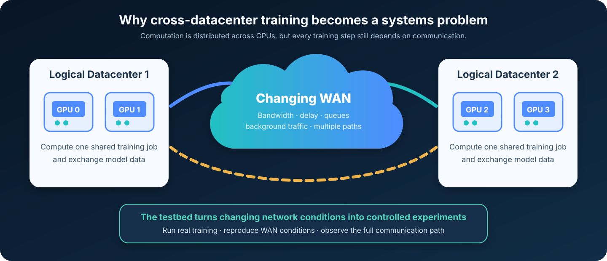
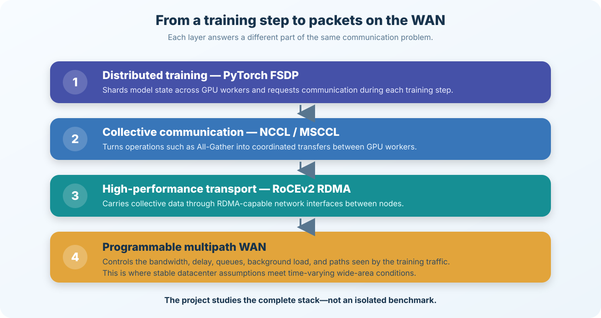
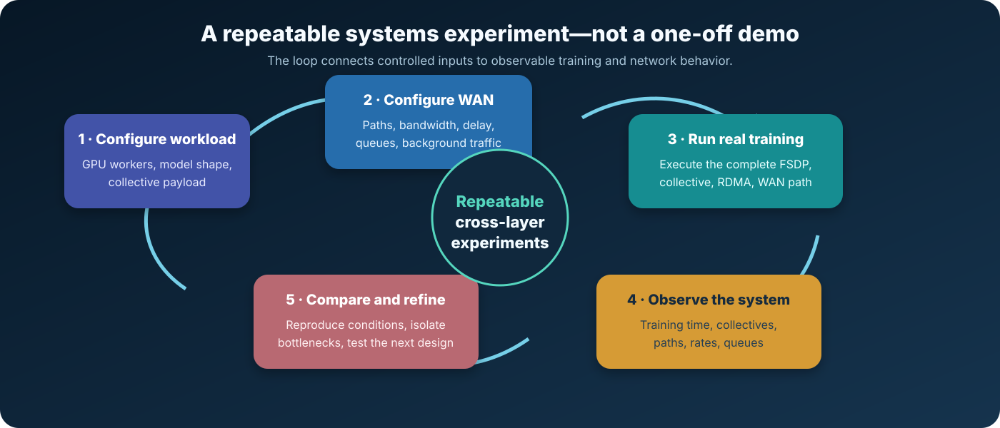

# Cross-Datacenter AI Training Testbed

> A visual, code-free introduction to a programmable environment for studying how distributed AI training behaves over changing wide-area networks.

## The story in one minute

Training a large AI model is often too much work for one GPU. The workload is therefore split across several GPUs, which repeatedly exchange model data to keep every worker synchronized.

Inside one datacenter, those exchanges usually travel over fast and relatively predictable links. Across datacenters, the same communication must cross a wide-area network (WAN), where available bandwidth, delay, competing traffic, and the best path can change over time.

This creates a systems problem:

> The GPUs may be ready to compute, but training still waits when their communication does not match the network available at that moment.

This project builds a controlled testbed around that problem. It connects real distributed GPU training to a programmable multipath WAN, making it possible to reproduce network changes, observe communication behavior, and study the interaction between the AI communication stack and the network beneath it.

## From model training to network packets

A training framework does not send model data directly onto the wire. Several layers cooperate:

1. **PyTorch FSDP** shards model state across GPU workers.
2. **Collective communication** reconstructs or aggregates distributed data when the training step needs it.
3. **NCCL and MSCCL** organize those collective transfers across communication channels.
4. **RoCEv2 RDMA** carries the transfers between GPU nodes.
5. A **programmable multipath WAN** determines the bandwidth, delay, queueing, and path conditions experienced by the traffic.

The value of the testbed is not any single layer. It is the ability to observe and reason about the complete path from a training operation down to network behavior.

## What the testbed contains

| Layer | Role in the project |
|---|---|
| Distributed training | Runs multi-node PyTorch FSDP workloads on GPU workers |
| Collective communication | Executes data exchange through NCCL and MSCCL |
| RDMA transport | Carries GPU communication using RoCEv2 |
| WAN environment | Provides multiple configurable paths between two logical datacenters |
| Network controls | Vary bandwidth, propagation delay, queues, and background traffic |
| Observability | Relates training timing to collective and per-path network behavior |
| Experiment workflow | Replays controlled conditions so that configurations can be compared consistently |

## Why a programmable WAN is necessary

A single static network configuration can answer only a narrow question. Real wide-area conditions evolve:

- one path may lose available bandwidth;
- background traffic may create temporary congestion;
- paths may have different delays or queueing behavior;
- the same training workload may generate very different communication pressure as its payload changes.

The testbed turns these effects into controlled experimental inputs rather than accidental noise.

Each experiment follows the same high-level loop:

1. choose a distributed training workload;
2. configure the WAN conditions to study;
3. run the workload through the complete GPU-to-WAN data path;
4. collect training, collective, and network telemetry;
5. compare behavior under repeatable conditions;
6. refine the system design based on the observed bottleneck.

## Engineering focus

The work sits at the intersection of three areas:

### Distributed AI systems

- multi-node GPU training with FSDP;
- collective operations such as All-Gather and Reduce-Scatter;
- synchronization between workers during repeated training steps.

### High-performance communication

- NCCL/MSCCL communication channels and schedules;
- RoCEv2 and RDMA-capable network interfaces;
- the path from GPU memory to a remote GPU worker.

### Network experimentation

- programmable forwarding over multiple WAN paths;
- controlled bandwidth, latency, queueing, and background load;
- per-path telemetry and repeatable workload replay.

## What this repository is — and is not

This repository is a **public-facing technical overview** of an ongoing thesis project. It is intentionally code-free and focuses on the problem, architecture, and experimental methodology.

It does **not** contain source code, private infrastructure details, unpublished research material, raw experiment data, or third-party project assets.

## Project status

The testbed is under active development. The current work focuses on improving experimental coverage, system observability, and the understanding of communication bottlenecks under a wider range of workloads and WAN conditions.

---

**Keywords:** Distributed AI Training · PyTorch FSDP · NCCL · MSCCL · RoCEv2 · RDMA · Collective Communication · Programmable WAN · Network Telemetry
