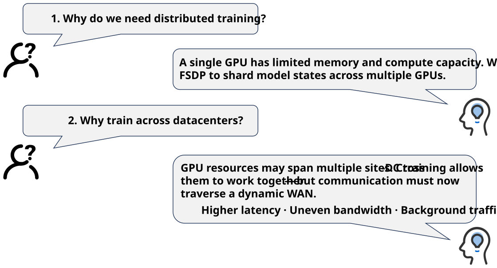
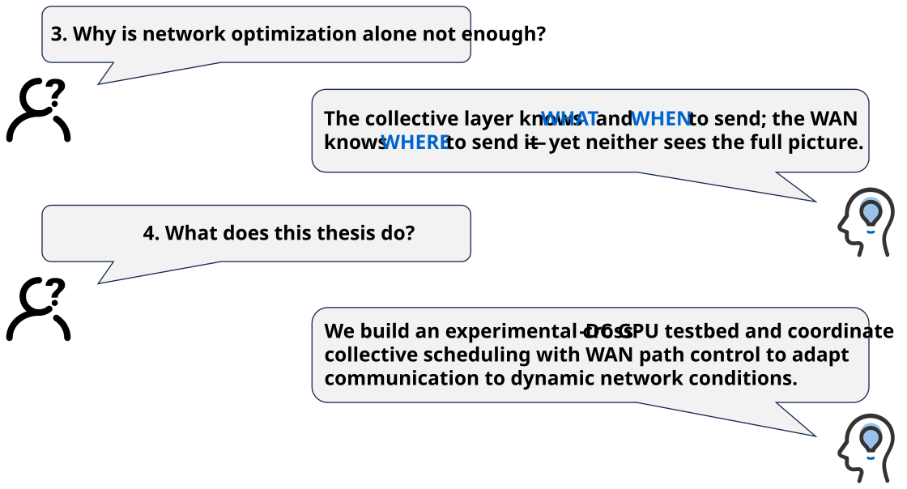

# Joint Collective Scheduling and WAN Path Adaptation for Cross-Datacenter AI Training

> An end-to-end experimental platform for coordinating collective communication schedules and RDMA traffic paths under dynamic WAN conditions.

## Project information

| | |
|---|---|
| **Institution** | Politecnico di Milano, Department of Electronics, Information and Bioengineering (DEIB) |
| **Laboratory** | [BONSAI Lab — Broadband Optical Networks, Security, and Advanced Internet](https://www.deib.polimi.it/eng/deib-labs/details/52) |
| **Period** | March 2026 – December 2026 (expected) |
| **Supervisors** | [Prof. Massimo Tornatore](https://tornatore.faculty.polimi.it/) · [Prof. Qiaolun Zhang](https://qiaolunzhang.github.io/) |

## Research motivation

**How can GPUs across datacenters train efficiently over a changing WAN?** This thesis studies the coordination of collective schedules and network paths on a real GPU testbed.

## 1. Why training depends on collective communication

<p align="center"><a href="figures/Pre/QA1QA2.svg"></a></p>

In FSDP, **All-Gather** assembles parameters for computation; **Reduce-Scatter** combines gradients and returns a shard to each worker.

<p align="center">
  <a href="figures/fsdp-all-gather.png"></a>
  &nbsp;
  <a href="figures/fsdp-reduce-scatter.png"></a>
</p>

Communication on the critical path leaves computation waiting. We therefore measure both collective latency and complete training-step time.

## 2. Why crossing datacenters changes the problem

The testbed connects four GPU workers across two logical datacenters. Its programmable WAN provides replayable path capacity, delay, queues, and background traffic for controlled comparisons.

<p align="center"></p>

## 3. Closing the loop across two layers

**A better path helps only when data is ready to use it.** This motivates coordinating collective dependencies with WAN path selection.

<p align="center"><a href="figures/Pre/QA3QA4.svg"></a></p>

- **Fast WAN adaptation** selects paths for ready RDMA traffic.
- **Slower schedule adaptation** changes transfer ordering and channel assignment.

<p align="center"></p>

Telemetry informs both actions; coordinated updates keep paths and schedule versions consistent. Their benefit must outweigh the observation and update costs.

<p align="center"></p>

```text
FSDP workload → collective schedule → RDMA transfers → WAN paths
       ↑                                             ↓
       └──── analysis and adaptation ← telemetry ───┘
```

## 4. From an FSDP tensor to WAN transfers

With four workers, each rank owns one quarter of the global payload. The collective schedule divides each shard into subchunks and determines when, where, and over which channel each subchunk moves.

<p align="center"></p>

- **FSDP** determines which distributed model data is required.
- **NCCL/MSCCL** organizes collective transfers and dependencies.
- **RoCEv2 RDMA** carries data between GPU nodes.
- The **WAN** supplies paths and time-varying capacity.

## 5. End-to-end GPU-to-GPU data path

GPU memory is registered for RDMA so the RNIC can move collective payloads directly. The WAN remains a transit network rather than a training endpoint.

<p align="center"></p>

```text
GPU memory → NCCL/MSCCL → GPUDirect RDMA → local RNIC
           → programmable WAN → remote RNIC → remote GPU memory
```

Runtime evidence verifies that NCCL selected direct GPU-memory access instead of staging the payload through host memory.

<p align="center"></p>

## 6. Why UDP destination port 4791 is special

RoCEv2 conventionally uses UDP destination port **4791**. A GPU endpoint should recognize and terminate the RDMA transport. A WAN node must instead forward the packet as transit IP traffic without consuming it as a local RDMA endpoint.

<p align="center"></p>

GPU-node RNICs therefore retain RoCEv2 endpoint behavior, while WAN-facing transit ports preserve and forward the original end-to-end packet.

## 7. Why collective dependencies matter

A collective schedule is a dependency graph, not merely a list of messages. Deep dependency chains hide parallelism and can leave WAN capacity idle. Restructuring All-Gather shortens the critical chain and releases useful transfers earlier.

<p align="center"></p>

The central insight is: **available WAN capacity helps only when the collective schedule has a ready transfer that can use it**.

## 8. Experimental results

A controlled interaction study separates two contributions: adaptive path steering and a low-dependency, channel-balanced All-Gather schedule. All configurations use the same workload and comparable WAN conditions.

<p align="center"></p>

| Configuration | All-Gather latency | Training-step time | AG reduction | Step-time reduction |
|---|---:|---:|---:|---:|
| Current schedule + baseline paths | 3275.8 ms | 9575.6 ms | — | — |
| Current schedule + adaptive paths | 2785.4 ms | 8488.9 ms | 15.0% | 11.3% |
| Low-dependency schedule + baseline paths | 2351.4 ms | 8568.9 ms | 28.2% | 10.5% |
| Low-dependency schedule + adaptive paths | **2135.0 ms** | **7906.3 ms** | **34.8%** | **17.4%** |

### What the results mean

- **Path steering removes transient network waste:** with the original schedule unchanged, it reduces All-Gather latency by 15.0%.
- **Schedule redesign exposes communication parallelism:** with baseline paths unchanged, it reduces All-Gather latency by 28.2%.
- **The mechanisms are complementary:** combining both reduces All-Gather latency by 34.8% and complete training-step time by 17.4%.
- **The gain does not come from sending less model data:** the redesigned schedule preserves approximately the same cross-datacenter traffic volume.

The benefit persists as the global All-Gather payload grows, rather than appearing at only one tensor size.

<p align="center"></p>

The system-level conclusion is that optimizing either the collective schedule or the WAN alone leaves performance on the table; coordinating both layers shortens the communication critical path and translates that gain into faster training steps.

## 9. Repeatable experimental workflow

1. Configure a distributed FSDP workload.
2. Define the WAN topology and replayable conditions.
3. Run the real NCCL/MSCCL and RoCEv2 path.
4. Collect synchronized training and network telemetry.
5. Verify executed paths, payload, and collective configuration.
6. Compare configurations under the same workload and WAN condition.
7. Trace the remaining bottleneck across dependencies and network behavior.

Controlled replay and end-to-end validation prevent a faster run from being mistaken for a better design when it merely encountered a different traffic window.

## Technical scope

| Area | Technologies and concepts |
|---|---|
| Distributed AI training | PyTorch FSDP, multi-node GPU workers |
| Collective communication | All-Gather, Reduce-Scatter, NCCL, MSCCL schedules |
| High-performance networking | RoCEv2, RDMA, GPUDirect RDMA, RNICs |
| WAN experimentation | Multipath forwarding, bandwidth, delay, queues, background traffic |
| Systems analysis | Cross-layer telemetry, dependency analysis, controlled validation |

## Repository scope

This repository is a **code-free technical presentation** of the testbed architecture, mechanisms, and validated findings. It excludes source code, private infrastructure details, raw logs, manuscripts, and organization-specific information.

---

**Keywords:** Distributed AI Training · PyTorch FSDP · NCCL · MSCCL · All-Gather · Reduce-Scatter · GPUDirect RDMA · RoCEv2 · UDP 4791 · Programmable WAN
